# Obesity Risk Insurance ML

A machine learning pipeline for predicting obesity risk classification, built for the **Modeling the Future Challenge (MTFC)**, a national actuarial modeling competition. The project frames obesity risk as an insurance underwriting problem: predicting an individual's weight-status category from lifestyle and biometric features, then using the trained models to simulate long-term risk trajectories for pricing and mitigation analysis.

This was a 5-person team project. I was responsible for the full modeling and programming analysis, which is what's contained in this repository.

## Project context

This project was originally developed in 2024–2025 for the Modeling the Future Challenge. This repository is a cleaned archival version created to share the modeling code, documentation, and some key results.

## Pipeline

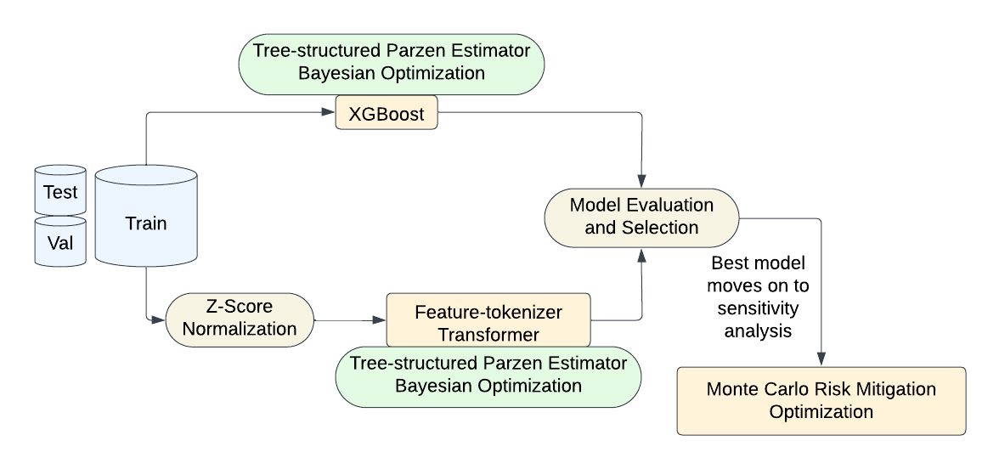

Raw survey/biometric data is cleaned and feature-engineered, then passed through several classification models (with Bayesian hyperparameter optimization), evaluated against each other, and the best-performing model feeds into a Monte Carlo simulation used to project long-term risk and evaluate mitigation strategies.

## Notebooks

| Notebook | Purpose |
|---|---|
| `notebooks/obesity-preprocessing.ipynb` | Data cleaning, feature engineering, and exploratory analysis |
| `notebooks/LogisticRegression.ipynb` | Baseline logistic regression classifier |
| `notebooks/XGBoost.ipynb` | XGBoost classifier |
| `notebooks/XGBoost-labelencoding.ipynb` | XGBoost variant with label-encoded categorical features |
| `notebooks/xgb_oat_and_lhs.ipynb` | One-at-a-time and Latin hypercube sampling sensitivity analysis on the XGBoost model |
| `notebooks/FTTransformer.ipynb` | Feature Tokenizer Transformer (FT-Transformer) deep learning classifier |
| `notebooks/SAINT.ipynb` | SAINT (Self-Attention and Intersample Attention Transformer) classifier |
| `notebooks/MCMC.ipynb` | Markov Chain Monte Carlo simulation of long-term obesity risk trajectories |

Models were tuned using Tree-structured Parzen Estimator (TPE) Bayesian optimization and evaluated by classification report, ROC-AUC (one-vs-rest), and confusion matrix across seven weight-status classes (Insufficient Weight, Normal Weight, Overweight Level I/II, Obesity Type I/II/III).

## Results

**Exploratory data analysis**

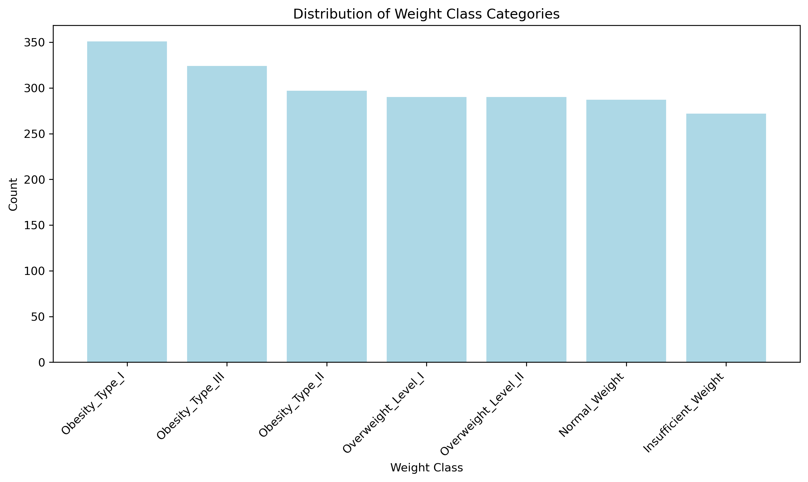
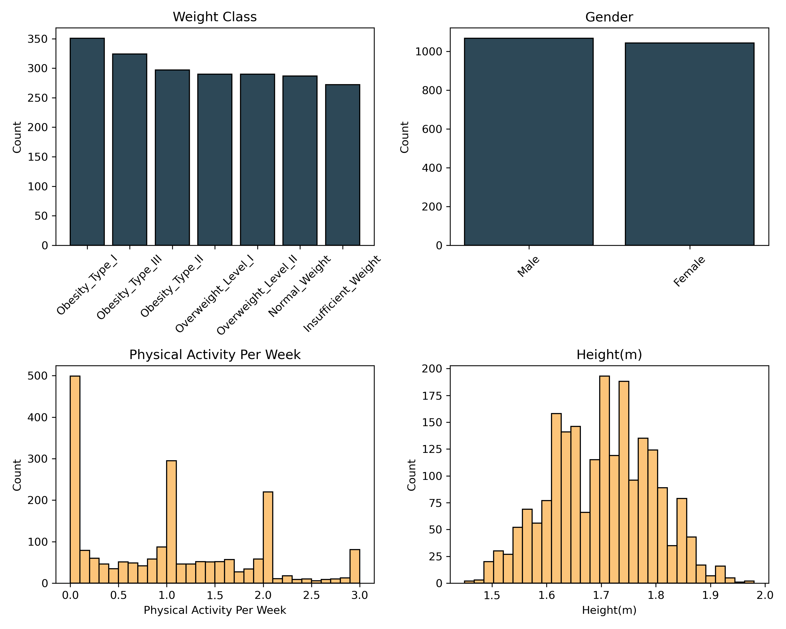

**Baseline (Logistic Regression)**

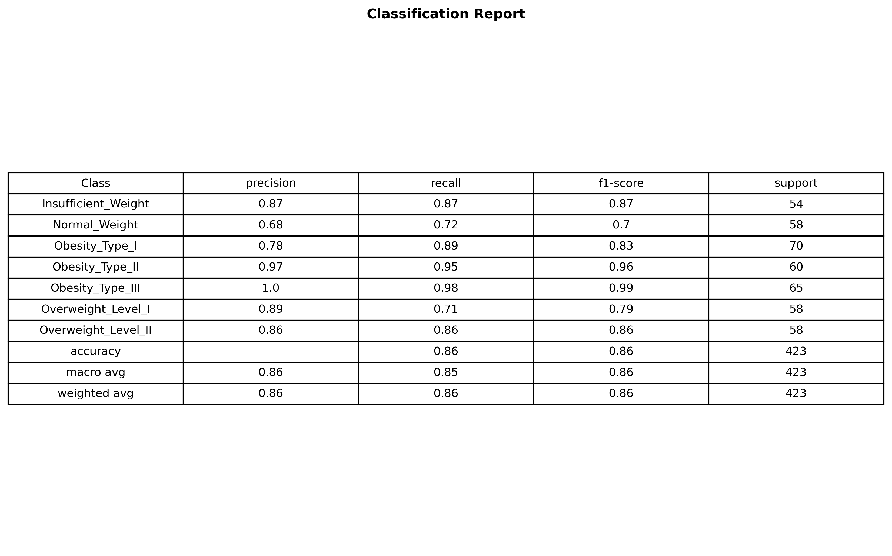

**XGBoost (tuned)**

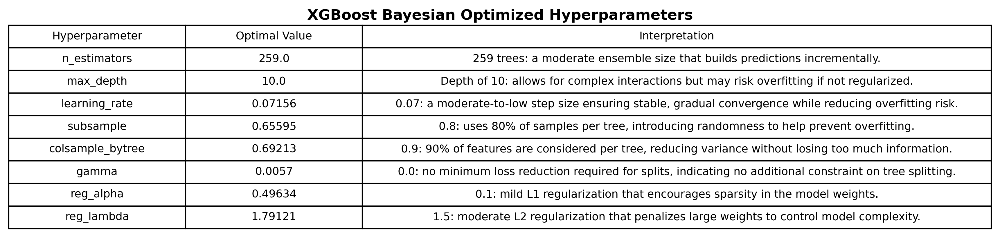
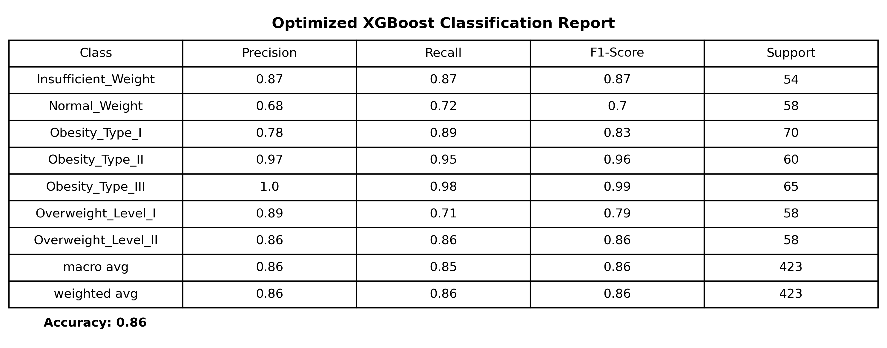
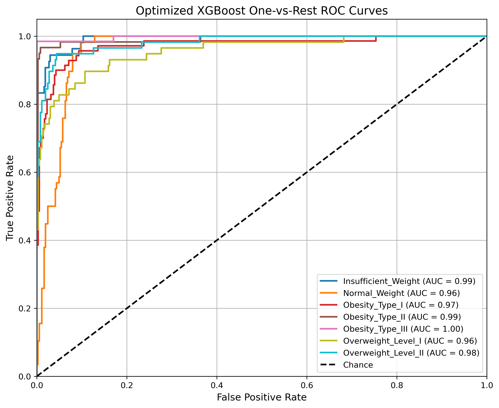
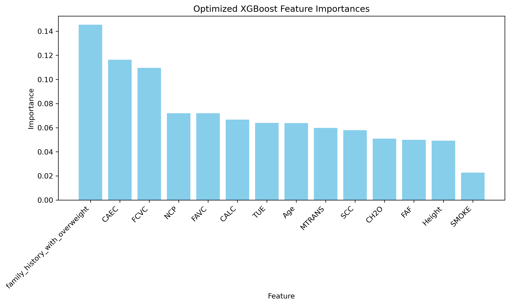

**FT-Transformer**

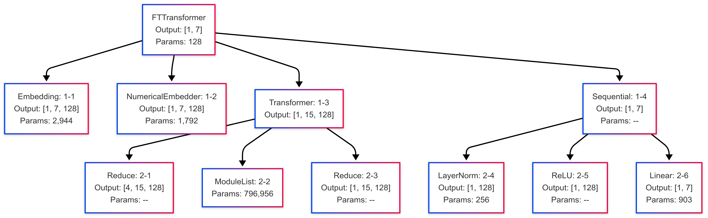
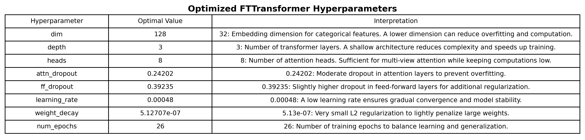
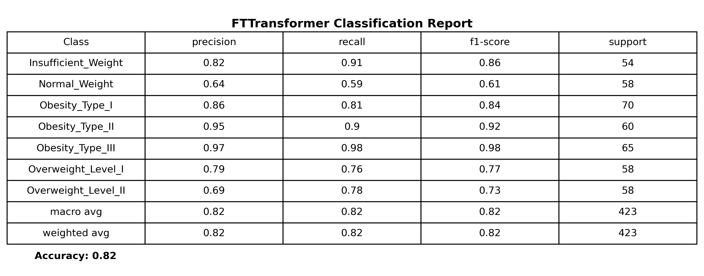
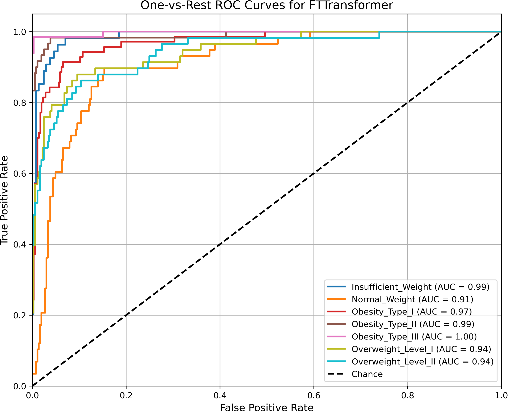

**Monte Carlo risk simulation**

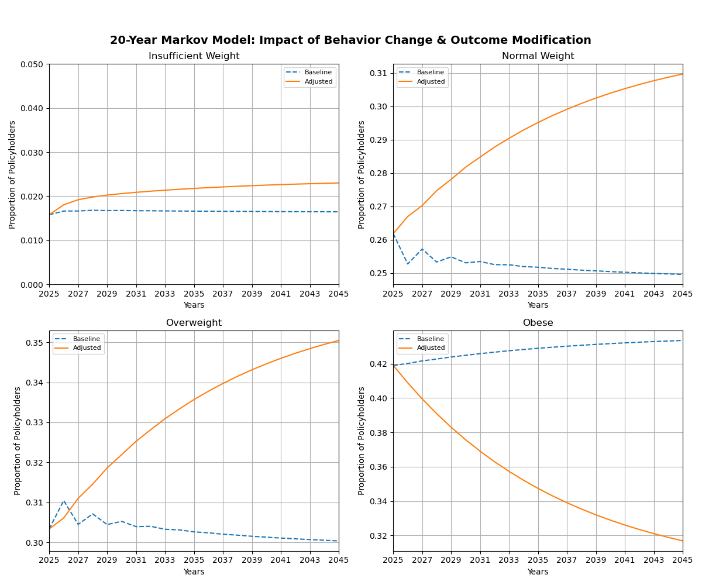
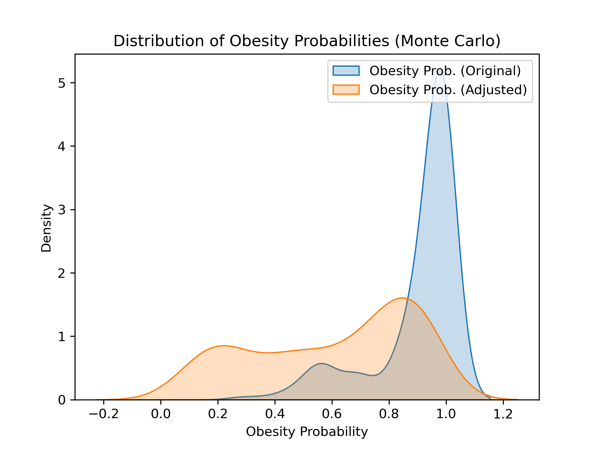
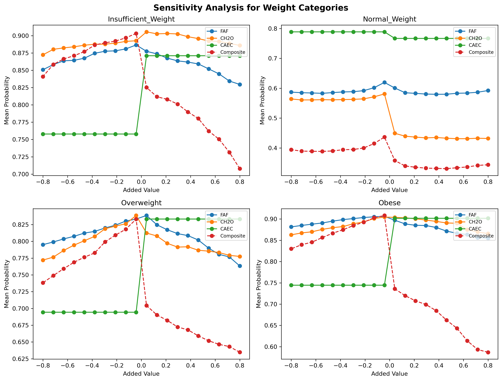
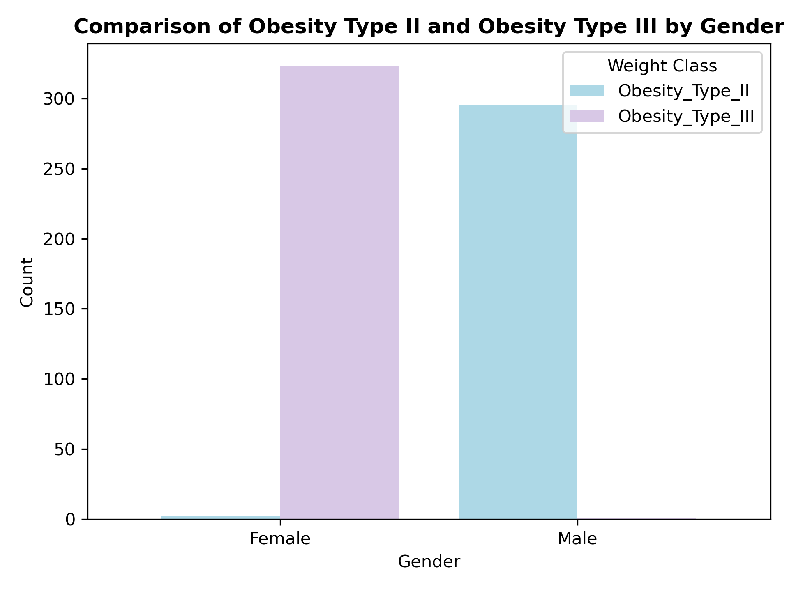

## Data

This repository does not include the underlying datasets or trained model weights (to keep the repo lightweight and avoid redistributing third-party data). The project draws on publicly available data from:

- [UCI Machine Learning Repository: Estimation of Obesity Levels Based On Eating Habits and Physical Condition](https://archive.ics.uci.edu/dataset/544/estimation+of+obesity+levels+based+on+eating+habits+and+physical+condition)
- CDC Behavioral Risk Factor Surveillance System (BRFSS)
- NHANES (National Health and Nutrition Examination Survey)

To reproduce results, download the relevant dataset(s) above and point the preprocessing notebook at them.

## Stack

Python, pandas, scikit-learn, XGBoost, PyTorch, Optuna/TPE (hyperparameter optimization), Matplotlib.

## Disclaimer

This project was created for educational and actuarial modeling purposes as part of the Modeling the Future Challenge. It is not a medical diagnostic tool, clinical recommendation system, insurance underwriting system, or financial product. Model outputs and simulations are intended only to demonstrate machine learning and risk-modeling methods on public datasets, and should not be used to make real-world medical, insurance, or financial decisions.
